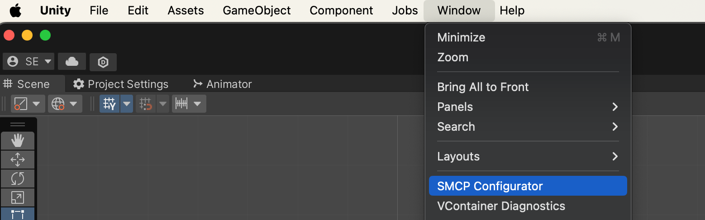
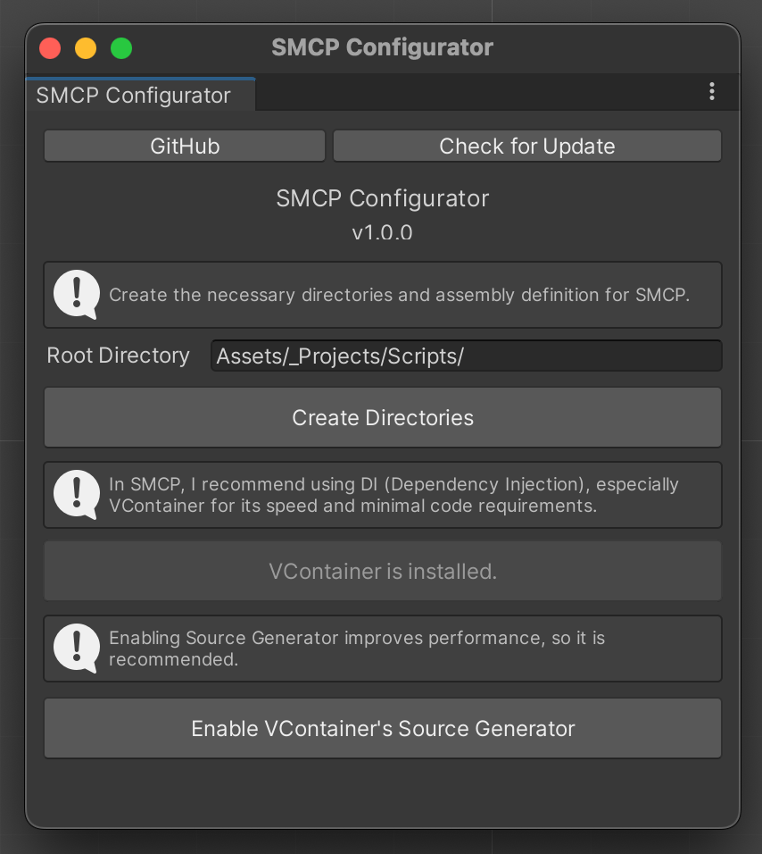

# SMCP Configurator

This plugin is designed to perform initial setup for the Unity-exclusive architecture pattern, SMCP.
For more details about SMCP, please refer to [this link](https://github.com/IShix-g/SMCPxPuzzleGame?tab=readme-ov-file#what-is-smcp).

## Install via git URL
Please add the URL to "Window > Package Manager > Add package from git URL...".

URL: `https://github.com/IShix-g/CMSuniVortex.git?path=Packages/CMSuniVortex`

## Usage

Open **Window > SMCP Configurator**

Follow the instructions in the dialog box.

