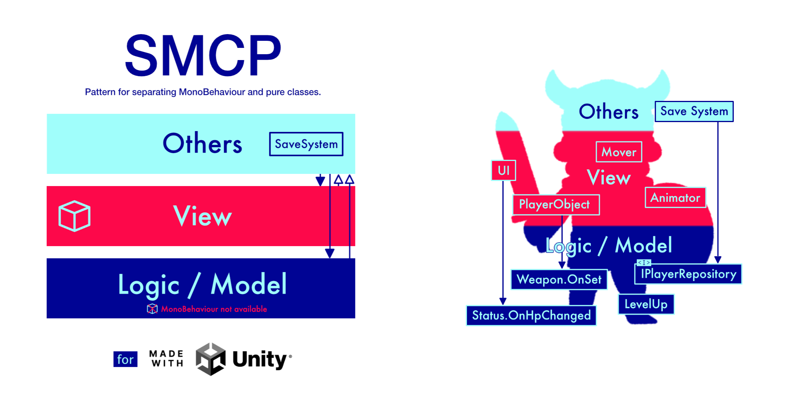
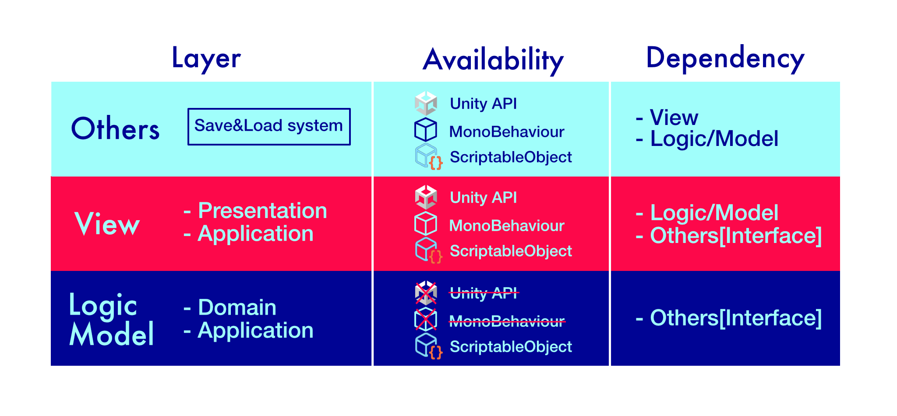

[README - 日本語版](README_jp.md)

# SMCP Configurator

このプラグインはUnity専用のアーキテクチャパターンSMCPの初期設定を簡単にするためのものです。

## SMCPとは?

詳しくは、[Unity専用のアーキテクチャパターン SMCP](https://qiita.com/IShix/items/5e1450ad8fb7f4a39f22) を確認ください。

## Getting Started

### Git Urlからインストール

"Unity Editor : Window > Package Manager > Add package from git URL...".

URL: `https://github.com/IShix-g/SMCP-Configurator.git?path=Packages/SMCPConfigurator`

### 設定画面を開く

"Unity Editor : Window > SMCP Configurator"

### 設定する

- パスを指定して`Create Directories`で生成します。 
- [オススメ] DIプラグインVContainerをインストールします。

## SMCPのサンプルコードを見る

https://github.com/IShix-g/SMCPxPuzzleGame

